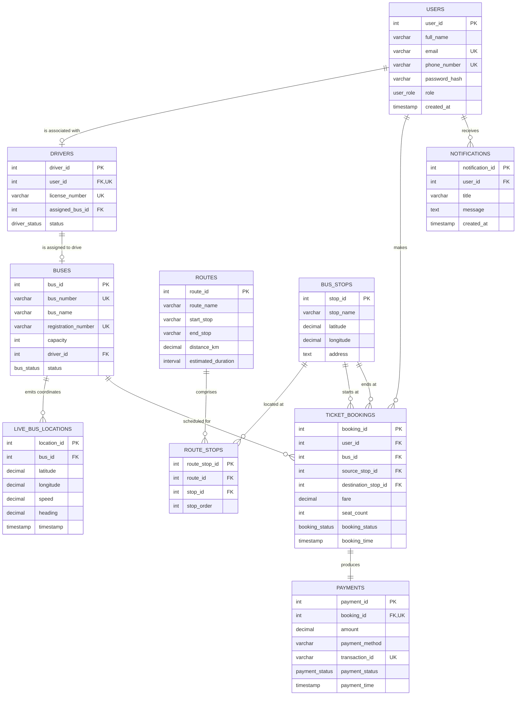

# Entity-Relationship (ER) Diagram

This diagram displays all 10 tables of the **Vrindavan Bus Navigation System**, including fields, types, primary keys, foreign keys, and cardinalities.

```mermaid
erDiagram
    USERS {
        int user_id PK
        varchar full_name
        varchar email UK
        varchar phone_number UK
        varchar password_hash
        user_role role
        timestamp created_at
    }

    DRIVERS {
        int driver_id PK
        int user_id FK, UK
        varchar license_number UK
        int assigned_bus_id FK
        driver_status status
    }

    BUSES {
        int bus_id PK
        varchar bus_number UK
        varchar bus_name
        varchar registration_number UK
        int capacity
        int driver_id FK
        bus_status status
    }

    ROUTES {
        int route_id PK
        varchar route_name
        varchar start_stop
        varchar end_stop
        decimal distance_km
        interval estimated_duration
    }

    BUS_STOPS {
        int stop_id PK
        varchar stop_name
        decimal latitude
        decimal longitude
        text address
    }

    ROUTE_STOPS {
        int route_stop_id PK
        int route_id FK
        int stop_id FK
        int stop_order
    }

    LIVE_BUS_LOCATIONS {
        int location_id PK
        int bus_id FK
        decimal latitude
        decimal longitude
        decimal speed
        decimal heading
        timestamp timestamp
    }

    TICKET_BOOKINGS {
        int booking_id PK
        int user_id FK
        int bus_id FK
        int source_stop_id FK
        int destination_stop_id FK
        decimal fare
        int seat_count
        booking_status booking_status
        timestamp booking_time
    }

    PAYMENTS {
        int payment_id PK
        int booking_id FK, UK
        decimal amount
        varchar payment_method
        varchar transaction_id UK
        payment_status payment_status
        timestamp payment_time
    }

    NOTIFICATIONS {
        int notification_id PK
        int user_id FK
        varchar title
        text message
        timestamp created_at
    }

    USERS ||--o| DRIVERS : "is associated with"
    USERS ||--o{ TICKET_BOOKINGS : "makes"
    USERS ||--o{ NOTIFICATIONS : "receives"
    DRIVERS ||--o| BUSES : "is assigned to drive"
    BUSES ||--o{ LIVE_BUS_LOCATIONS : "emits coordinates"
    BUSES ||--o{ TICKET_BOOKINGS : "scheduled for"
    ROUTES ||--o{ ROUTE_STOPS : "comprises"
    BUS_STOPS ||--o{ ROUTE_STOPS : "located at"
    TICKET_BOOKINGS ||--|| PAYMENTS : "produces"
    BUS_STOPS ||--o{ TICKET_BOOKINGS : "starts at"
    BUS_STOPS ||--o{ TICKET_BOOKINGS : "ends at"
```
