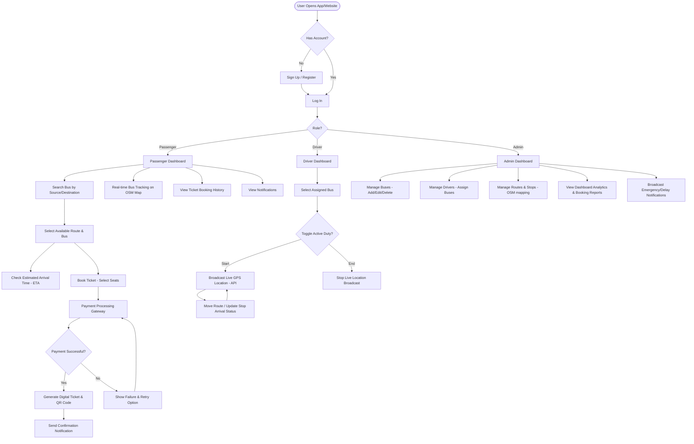

# User Flow Diagram

This document illustrates the operations and flows of the three primary system actors: **Passengers**, **Drivers**, and **Admins** inside the Vrindavan Bus Navigation System.

```mermaid
graph TD
    %% Base Flow
    Start([User Opens App/Website]) --> Auth{Has Account?}
    Auth -- No --> Register[Sign Up / Register] --> Login[Log In]
    Auth -- Yes --> Login
    Login --> RoleSplit{Role?}

    %% PASSENGER FLOW
    RoleSplit -- Passenger --> PassDash[Passenger Dashboard]
    PassDash --> Search[Search Bus by Source/Destination]
    Search --> SelectRoute[Select Available Route & Bus]
    SelectRoute --> CheckETA[Check Estimated Arrival Time - ETA]
    SelectRoute --> BookTicket[Book Ticket - Select Seats]
    BookTicket --> PaymentPortal[Payment Processing Gateway]
    PaymentPortal --> PayConfirm{Payment Successful?}
    PayConfirm -- Yes --> GenerateTicket[Generate Digital Ticket & QR Code] --> Notify[Send Confirmation Notification]
    PayConfirm -- No --> PayError[Show Failure & Retry Option] --> PaymentPortal
    
    PassDash --> TrackBus[Real-time Bus Tracking on OSM Map]
    PassDash --> Hist[View Ticket Booking History]
    PassDash --> NotificationsList[View Notifications]

    %% DRIVER FLOW
    RoleSplit -- Driver --> DriverDash[Driver Dashboard]
    DriverDash --> SelectBus[Select Assigned Bus]
    SelectBus --> DutyToggle{Toggle Active Duty?}
    DutyToggle -- Start --> GPSStart[Broadcast Live GPS Location - API]
    GPSStart --> Drive[Move Route / Update Stop Arrival Status] --> GPSStart
    DutyToggle -- End --> GPSEnd[Stop Live Location Broadcast]

    %% ADMIN FLOW
    RoleSplit -- Admin --> AdminDash[Admin Dashboard]
    AdminDash --> ManageBuses[Manage Buses - Add/Edit/Delete]
    AdminDash --> ManageDrivers[Manage Drivers - Assign Buses]
    AdminDash --> ManageRoutes[Manage Routes & Stops - OSM mapping]
    AdminDash --> ViewAnalytics[View Dashboard Analytics & Booking Reports]
    AdminDash --> SendAlerts[Broadcast Emergency/Delay Notifications]
```
